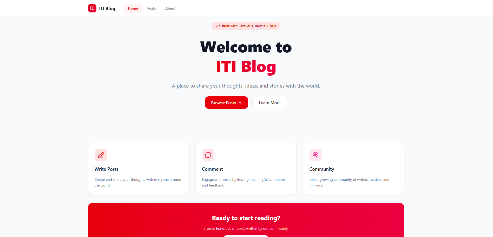
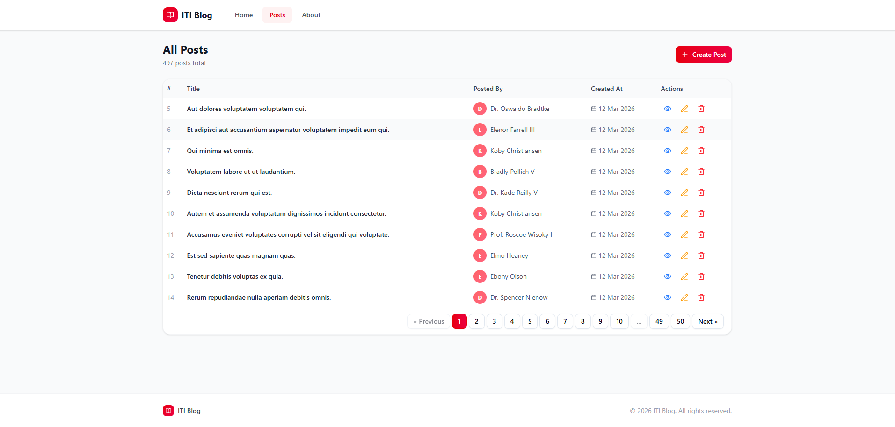
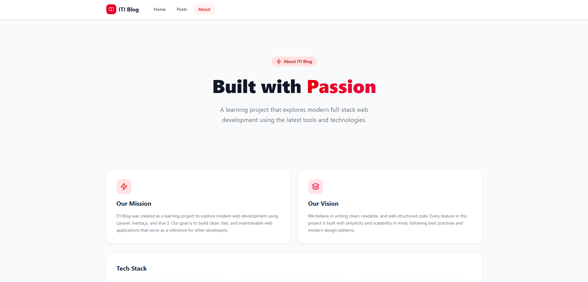

<p align="center">
  <a href="#" target="_blank">
    
  </a>
</p>

<h1 align="center">ITI Blog</h1>
<p align="center">
  <em>A modern, full-stack blog application built with Laravel, Inertia.js, and Vue 3</em>
</p>

<p align="center">
  <a href="https://www.php.net/" target="_blank">
    
  </a>
  <a href="https://laravel.com/" target="_blank">
    
  </a>
  <a href="https://vuejs.org/" target="_blank">
    
  </a>
  <a href="https://inertiajs.com/" target="_blank">
    
  </a>
  <a href="https://tailwindcss.com/" target="_blank">
    
  </a>
</p>

<p align="center">
  <a href="#-features">🚀 Features</a> •
  <a href="#-demo">🎬 Demo</a> •
  <a href="#-getting-started">⚡ Getting Started</a> •
  <a href="#-tech-stack">🛠️ Tech Stack</a> •
  <a href="#-contributing">🤝 Contributing</a> •
  <a href="#-license">📄 License</a>
</p>

---

## 📖 About

ITI Blog is a beautifully designed, modern blog application that demonstrates the power of combining Laravel's robust backend with Vue.js's reactive frontend. Built as a learning project, it showcases best practices in full-stack development, featuring a clean architecture, responsive design, and smooth user experience.

### 🎯 Project Goals

- **Learn Modern Full-Stack Development**: Explore the synergy between Laravel and Vue.js
- **Best Practices**: Implement clean, maintainable code following industry standards
- **Beautiful UI**: Create an intuitive, responsive user interface with modern design principles
- **Real-World Features**: Build practical functionality that can be extended for production use

---

## 🚀 Features

### ✨ Core Functionality
- **📝 Post Management**: Create, read, update, and delete blog posts
- **💬 Comment System**: Add and manage comments on posts with user attribution
- **👥 User Management**: Assign posts and comments to different users
- **📱 Responsive Design**: Seamless experience across all devices
- **🎨 Modern UI**: Beautiful gradient design with smooth animations

### 🛠️ Technical Features
- **⚡ SPA Experience**: Single-page application feel with Inertia.js
- **🔄 Real-time Updates**: Dynamic content updates without page reloads
- **📄 Pagination**: Efficient data handling for large datasets
- **🎭 Modal Dialogs**: Elegant user interactions with confirmation dialogs
- **🧭 Navigation**: Intuitive routing with active state indicators

---

## 🎬 Demo

### 📸 Screenshots

<p align="center">
  <strong>Home Page</strong><br>
  
</p>

<p align="center">
  <strong>Posts Management</strong><br>
  
</p>

<p align="center">
  <strong>About Page</strong><br>
  
</p>

---

## ⚡ Getting Started

### 📋 Prerequisites

- **PHP** >= 8.2
- **Composer** >= 2.0
- **Node.js** >= 18.0
- **npm** >= 8.0
- **MySQL** >= 8.0 or **PostgreSQL** >= 12.0

### 🛠️ Installation

1. **📥 Clone the repository**
   ```bash
   git clone https://github.com/your-username/iti-blog.git
   cd iti-blog
   ```

2. **📦 Install PHP dependencies**
   ```bash
   composer install
   ```

3. **📦 Install JavaScript dependencies**
   ```bash
   npm install
   ```

4. **⚙️ Environment setup**
   ```bash
   cp .env.example .env
   php artisan key:generate
   ```

5. **🗄️ Database setup**
   ```bash
   # Edit your .env file with database credentials
   php artisan migrate
   php artisan db:seed
   ```

6. **🚀 Start the development servers**
   ```bash
   # Terminal 1: Laravel server
   php artisan serve

   # Terminal 2: Vite development server
   npm run dev
   ```

7. **🌐 Access the application**
   - Open your browser and navigate to `http://localhost:8000`

---

## 🛠️ Tech Stack

### 🎨 Frontend
- **[Vue.js 3](https://vuejs.org/)** - Progressive JavaScript framework
- **[Inertia.js](https://inertiajs.com/)** - Modern monolith SPA bridge
- **[Tailwind CSS v4](https://tailwindcss.com/)** - Utility-first CSS framework
- **[shadcn-vue](https://www.shadcn-vue.com/)** - Beautiful UI components
- **[Lucide Vue](https://lucide.dev/)** - Icon library
- **[Vite](https://vitejs.dev/)** - Fast build tool

### 🚀 Backend
- **[Laravel 12](https://laravel.com/)** - PHP web framework
- **[MySQL](https://www.mysql.com/)** - Relational database
- **[Eloquent ORM](https://laravel.com/docs/eloquent)** - Database ORM
- **[Blade](https://laravel.com/docs/blade)** - Template engine

### 🔧 Development Tools
- **[Composer](https://getcomposer.org/)** - PHP dependency manager
- **[npm](https://www.npmjs.com/)** - JavaScript package manager
- **[Git](https://git-scm.com/)** - Version control

---

## 📁 Project Structure

```
iti-blog/
├── app/                    # Laravel application code
│   ├── Http/Controllers/   # Application controllers
│   ├── Models/            # Eloquent models
│   └── Policies/          # Authorization policies
├── database/              # Database files
│   ├── migrations/        # Database migrations
│   └── seeders/          # Database seeders
├── resources/
│   ├── js/               # Vue.js components and pages
│   │   ├── Components/   # Reusable Vue components
│   │   ├── Layouts/      # Layout components
│   │   └── Pages/        # Page components
│   └── views/           # Blade templates
├── routes/               # Application routes
├── storage/              # Storage files
└── public/              # Public assets
```

---

## 🎨 Design System

### 🎯 Color Palette
- **Primary Red**: `#FF2D20` (Laravel Red)
- **Rose Gradient**: `#FF2D20` to `#FB7185`
- **Neutral Grays**: `#F9FAFB` to `#111827`

### 📐 Typography
- **Headings**: Inter, Bold
- **Body**: Inter, Regular
- **Code**: JetBrains Mono

### 🎭 Components
- **Buttons**: Gradient backgrounds with hover effects
- **Cards**: Rounded corners with subtle shadows
- **Modals**: Backdrop blur with smooth animations
- **Navigation**: Sticky header with active states

---

## 🔧 Configuration

### 📝 Environment Variables

Key environment variables to configure:

```env
# Database
DB_CONNECTION=mysql
DB_HOST=127.0.0.1
DB_PORT=3306
DB_DATABASE=iti_blog
DB_USERNAME=root
DB_PASSWORD=

# Application
APP_NAME="ITI Blog"
APP_ENV=local
APP_KEY=base64:...
APP_DEBUG=true
APP_URL=http://localhost:8000
```

### 🗄️ Database Schema

The application uses the following main tables:
- `users` - User accounts
- `posts` - Blog posts
- `comments` - Post comments

---

## 🚀 Deployment

### 🐳 Docker Deployment

```bash
# Build and run with Docker
docker-compose up -d
```

### 🌐 Production Deployment

1. **🔧 Configure production environment**
   ```bash
   cp .env.example .env
   # Edit .env with production values
   ```

2. **📦 Install dependencies**
   ```bash
   composer install --no-dev --optimize-autoloader
   npm install --production
   ```

3. **🏗️ Build assets**
   ```bash
   npm run build
   ```

4. **🗄️ Run migrations**
   ```bash
   php artisan migrate --force
   ```

5. **⚡ Optimize application**
   ```bash
   php artisan config:cache
   php artisan route:cache
   php artisan view:cache
   ```

---

## 🤝 Contributing

We welcome contributions! Please follow these steps:

1. **🍴 Fork the repository**
2. **🌿 Create a feature branch**
   ```bash
   git checkout -b feature/amazing-feature
   ```
3. **💾 Commit your changes**
   ```bash
   git commit -m 'Add amazing feature'
   ```
4. **📤 Push to the branch**
   ```bash
   git push origin feature/amazing-feature
   ```
5. **🔄 Open a Pull Request**

### 📋 Development Guidelines

- Follow PSR-12 coding standards
- Write clear, descriptive commit messages
- Add tests for new features
- Update documentation as needed

---

## 🐛 Troubleshooting

### 🔧 Common Issues

**Issue: Vite build fails**
```bash
# Clear npm cache and reinstall
npm cache clean --force
rm -rf node_modules package-lock.json
npm install
```

**Issue: Laravel mix not working**
```bash
# Clear Laravel caches
php artisan config:clear
php artisan cache:clear
php artisan view:clear
```

**Issue: Database connection errors**
```bash
# Check database credentials in .env
# Ensure database server is running
# Verify database exists
```

---

## 📄 License

This project is licensed under the **MIT License** - see the [LICENSE](LICENSE) file for details.

---

## 🙏 Acknowledgments

- **[Laravel](https://laravel.com/)** - Amazing PHP framework
- **[Vue.js](https://vuejs.org/)** - Reactive JavaScript framework
- **[Tailwind CSS](https://tailwindcss.com/)** - Utility-first CSS framework
- **[Inertia.js](https://inertiajs.com/)** - Modern monolith SPA bridge
- **[shadcn-vue](https://www.shadcn-vue.com/)** - Beautiful UI components

---

## 📞 Contact

- **Author**: [Amera Mohammed]
- **Email**: [ameraelsa3id@gmail.com]
- **LinkedIn**: [https://www.linkedin.com/in/amera-mohammed/]
- **GitHub**: [https://github.com/AmiraElsa3id]

---

<p align="center">
  <strong>⭐ If you like this project, please give it a star! ⭐</strong>
</p>
